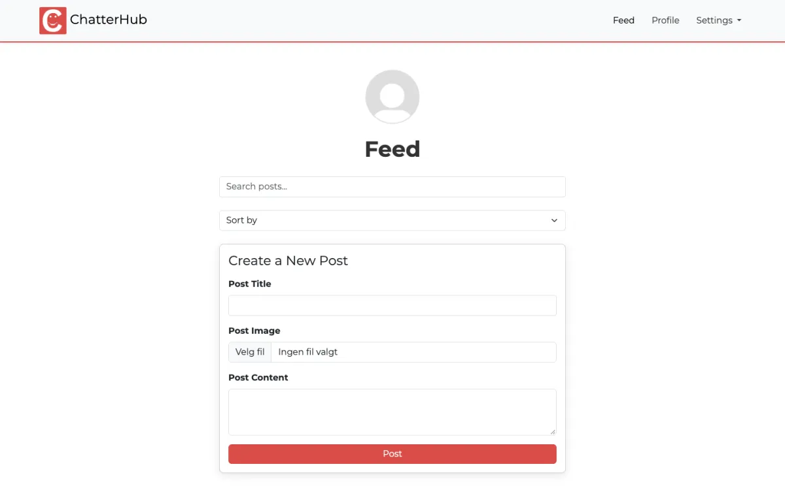

# ChatterHub

A responsive social media front-end built with Bootstrap 5 and SCSS for the Noroff CSS Frameworks course assignment.

**Live demo:** https://css-frameworks-danielleiken.netlify.app

> The live site is deployed from the later `js2` branch, where the same design was connected to the Noroff Social API. This branch (`css-frameworks`) holds the static CSS Frameworks version.



## Description

ChatterHub is a static, multipage prototype of a social media app. The goal of the assignment was to use a CSS framework (Bootstrap) together with SCSS to build a consistent, responsive interface with a custom look: a red and lilac colour theme, the Montserrat font and customised Bootstrap components such as the navbar, cards, buttons and forms.

## Pages

| Page | Path | Content |
| --- | --- | --- |
| Login / Register | `/index.html` | Logo, tagline and a login form with client-side validation |
| Feed | `/feed/index.html` | Search, sort, a form for creating a new post and a grid of post cards |
| Profile | `/profile/index.html` | Profile picture, editable profile details, followers/following and bio |

## Built with

- HTML5
- [Bootstrap 5.3](https://getbootstrap.com/) (CSS and JS bundle via CDN)
- [Sass/SCSS](https://sass-lang.com/)
- Google Fonts (Montserrat)
- Hosted on [Netlify](https://www.netlify.com/)

## Getting started

### Installing

1. Clone the repository:

   ```bash
   git clone https://github.com/Daniel-leiken/css-frameworks-ca-danielstrandheim.git
   cd css-frameworks-ca-danielstrandheim
   ```

2. Check out the CSS Frameworks branch:

   ```bash
   git checkout css-frameworks
   ```

3. Install the dependencies:

   ```bash
   npm install
   ```

### Running

- Start a local server with live reload:

  ```bash
  npm start
  ```

  You can also use any static server (for example `npx serve .`) or the VS Code Live Server extension. Serve the project root, since the pages use root-relative paths such as `/images/` and `/src/scss/`.

- Compile the SCSS once (`src/scss/index.scss` to `src/scss/index.css`, the file the pages load):

  ```bash
  npm run build
  ```

- Or watch the SCSS and recompile on save:

  ```bash
  npm run sass
  ```

## Improvements after submission

After getting feedback I went back and made these improvements:

- **Form validation now works.** The validation script looked for `.needs-validation`, but no form had that class. The login and profile forms now show Bootstrap's validation messages.
- **Fixed a broken image and wrong page details.** The profile page used a dead placeholder image service. The Feed page had the title "Profile" and highlighted the wrong nav link.
- **Accessibility and semantics.** Each page has one `<h1>`, a `<main>` landmark and headings in a logical order. Form controls have accessible names, alt texts are more descriptive and each page has a meta description.
- **Stable Bootstrap.** Upgraded from the pre-release `5.3.0-alpha1` to `5.3.3`.
- **Working build scripts.** `package.json` had template metadata and Sass scripts pointing at files that did not exist. I also merged a duplicated `.navbar` rule in the SCSS.

## Contributing

This is a school project, so I'm not looking for code contributions. If you find a bug or have a suggestion, feel free to [open an issue](https://github.com/Daniel-leiken/css-frameworks-ca-danielstrandheim/issues). Pull requests are welcome too: fork the repo, create a branch for your change and open a pull request so the change can be reviewed.

## Contact

- GitHub: [Daniel-leiken](https://github.com/Daniel-leiken)
- LinkedIn: [Daniel Strandheim](https://www.linkedin.com/in/daniel-strandheim)
